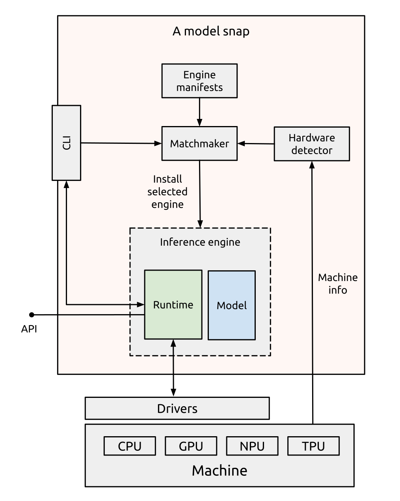

# Architecture

<!-- Another doc should explain what problem do we solve with this architecture -->

Famous Models provide easy access to silicon-optimized local inference. 
They use snaps and rely on their rich software life cycle management ecosystem to deliver the necessary components.

The primary focus of Famous Models is on Generative AI models that are pre-trained and fine-tuned.
Famous Models provide an automatic mechanism to deliver a balance of accuracy and performance tailored to the underlying silicon. 
They hide the complexity of picking model quantization and runtime optimizations from the users.

Each Famous Model snap maps to a single, fine-tuned AI model. The snap is associated with multiple [engines](../index), which are optimizations for various hardware, but installs the one that is deemed most suitable.
<!-- Another doc should explain the selection mechanism -->

In a more technical sense, each engine consists of a manifest and one or more artifacts. 
The manifest describes the requirements of the engine, such as how much memory or what GPU or NPU it needs, as well as its software components and default configurations. This information is used to select and deploy an engine on the host.

Each engine is expected to be usable in its application context, for example by providing a runtime and a networking API for user and machine interaction.

The components of the system are shown below:

Where:

* **AI model snap** is a snap package corresponding to a model. The snap is named after the model.
  * **Stack manifests** are documents that describe each inference engine; see {ref}`engine-manifest`
  * **Hardware detector** is responsible for generating a report on the available hardware and compute resources  
  * **Matchmaker** is in charge of selecting and installing an engine
  * **Inference stack** is the engine that gets installed at runtime. Only one engine can be active at a time.  
    * **Runtime** is the inference runtime serving the model and providing a standard API.  
    * **Model** contains the model weights  
  * **CLI** is a command-line interface for managing the snap; see {ref}`models-cli`
* **Drivers** are kernel and user-space binaries/libraries installed on the host. 
* **Hardware** refers to the compute nodes, including CPUs and accelerators.
